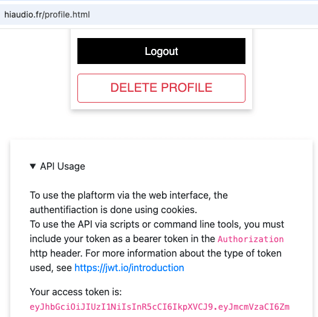

# hiaudio_import

A script to import multi-track music datasets into the [Hi-Audio](https://hiaudio.fr) platform.


## Prerequisites

- Python 3.x
- A registered account on [hiaudio.fr](https://hiaudio.fr)
- A valid API token — log in, go to your [profile page](https://hiaudio.fr/profile.html), and copy the API token value.



Set the token as an environment variable before running the script:

```bash
export JWT="your_api_token"
```

## Install

```bash
git clone https://github.com/idsinge/hiaudio_import.git
cd hiaudio_import

python3 -m venv venv 

. venv/bin/activate

pip install -e . 
```

This will install a `hiaudio_import` script in the PATH of the venv. This script only runs the `main()` function of the `hiaudio_import/hiimport.py` file which can be edited without reinstalling the package. 


**NOTE**: You may need to run `python3 -m pip install --upgrade pip` if `pip install -e . ` throws an error


## Usage

The basic idea is to provide the script with patterns on how to find collections, compositions and tracks to import. 

```
$ hiaudio_import -h
usage: hiaudio_import [-h] [--loglevel {DEBUG,INFO,WARNING,ERROR,CRITICAL}] [--endpoint ENDPOINT] [--token-var TOKEN_VAR] --dataset-path DATASET_PATH [--parent-collection PARENT_COLLECTION] [--collections-pattern COLLECTIONS_PATTERN] [--compositions-pattern COMPOSITIONS_PATTERN]
                      [--tracks-pattern TRACKS_PATTERN] [--tracks-exclude-pattern TRACKS_EXCLUDE_PATTERN]

An import script for hiaudio.fr

options:
  -h, --help            show this help message and exit
  --loglevel {DEBUG,INFO,WARNING,ERROR,CRITICAL}
                        Global log level (default: INFO)
  --endpoint ENDPOINT   the endpoint location of the platform (default: https://hiaudio.fr)
  --token-var TOKEN_VAR
                        the environment variable containing the JWT for API requests (default: JWT)
  --dataset-path DATASET_PATH
                        the main folder containing the dataset (default: None)
  --parent-collection PARENT_COLLECTION
                        an option collection name for everything that will be imported (default: None)
  --collections-pattern COLLECTIONS_PATTERN
                        the pattern to find collections folders, relative to dataset root. Use empty string to disable collections. (default: )
  --compositions-pattern COMPOSITIONS_PATTERN
                        the pattern to find compositions (default: %(collection_path)s/*)
  --tracks-pattern TRACKS_PATTERN
                        the pattern to find tracks (default: %(composition_path)s/*)
  --tracks-exclude-pattern TRACKS_EXCLUDE_PATTERN
                        the pattern for track names to exclude (e.g.: mixture.wav) (default: )
  --privacy-level {public,onlyreg,private}
                        the level of privacy for the new compositions (default: private)
```


## Examples

The following examples are based on the [DSD100 sample](https://www.loria.fr/~aliutkus/DSD100subset.zip) dataset which has the following file structure:

```
$ tree DSD100subset
DSD100subset
├── Mixtures
│   ├── Dev
│   │   ├── 055 - Angels In Amplifiers - I'm Alright
│   │   │   └── mixture.wav
│   │   └── 081 - Patrick Talbot - Set Me Free
│   │       └── mixture.wav
│   └── Test
│       ├── 005 - Angela Thomas Wade - Milk Cow Blues
│       │   └── mixture.wav
│       └── 049 - Young Griffo - Facade
│           └── mixture.wav
├── Sources
│   ├── Dev
│   │   ├── 055 - Angels In Amplifiers - I'm Alright
│   │   │   ├── bass.wav
│   │   │   ├── drums.wav
│   │   │   ├── other.wav
│   │   │   └── vocals.wav
│   │   └── 081 - Patrick Talbot - Set Me Free
│   │       ├── bass.wav
│   │       ├── drums.wav
│   │       ├── other.wav
│   │       └── vocals.wav
│   └── Test
│       ├── 005 - Angela Thomas Wade - Milk Cow Blues
│       │   ├── bass.wav
│       │   ├── drums.wav
│       │   ├── other.wav
│       │   └── vocals.wav
│       └── 049 - Young Griffo - Facade
│           ├── bass.wav
│           ├── drums.wav
│           ├── other.wav
│           └── vocals.wav
├── dsd100.xlsx
└── dsd100subset.txt

14 directories, 22 files
```


Here are some script commands to import the data, depending on the wanted resulting structure:

```bash

# first add the JWT token to the environment variables for API call
export JWT="myjwtoken"

# for localhost testing add "--endpoint https://localhost:7007" to all commands


# import all compositions in Sources/, whether they are in Dev/ or in Test/, into a flat hierarchy
hiaudio_import  --dataset-path ../DSD100subset/ --compositions-pattern "Sources/*/*"


# import all compositions in Sources/, whether they are in Dev/ or in Test/, all under a parent collection (with debug level logging)
hiaudio_import --loglevel DEBUG --dataset-path ../DSD100subset/ --compositions-pattern "Sources/*/*" --parent-collection "DSD100subset" 


# import compositions in Sources dir, following the directory structure for collections 
# (the default values for compositions and tracks patterns will find the right data here)
hiaudio_import --dataset-path ../DSD100subset/ --collections-pattern "Sources/*"

```

Sample run of the last example: 

```
2023-10-18 16:00:21 [hiaudio_import.hiimport:MainThread] INFO: [1/2] Found collection 'Dev' at Sources/Dev
2023-10-18 16:00:21 [hiaudio_import.hiimport:MainThread] INFO:  [1/2] Found composition 055 - Angels In Amplifiers - I'm Alright
2023-10-18 16:00:21 [hiaudio_import.hiimport:MainThread] INFO:          [1/4] Adding track: bass.wav
2023-10-18 16:00:21 [hiaudio_import.hiimport:MainThread] INFO:          [2/4] Adding track: drums.wav
2023-10-18 16:00:21 [hiaudio_import.hiimport:MainThread] INFO:          [3/4] Adding track: other.wav
2023-10-18 16:00:21 [hiaudio_import.hiimport:MainThread] INFO:          [4/4] Adding track: vocals.wav
2023-10-18 16:00:22 [hiaudio_import.hiimport:MainThread] INFO:  [2/2] Found composition 081 - Patrick Talbot - Set Me Free
2023-10-18 16:00:22 [hiaudio_import.hiimport:MainThread] INFO:          [1/4] Adding track: bass.wav
2023-10-18 16:00:22 [hiaudio_import.hiimport:MainThread] INFO:          [2/4] Adding track: drums.wav
2023-10-18 16:00:22 [hiaudio_import.hiimport:MainThread] INFO:          [3/4] Adding track: other.wav
2023-10-18 16:00:22 [hiaudio_import.hiimport:MainThread] INFO:          [4/4] Adding track: vocals.wav
2023-10-18 16:00:22 [hiaudio_import.hiimport:MainThread] INFO: [2/2] Found collection 'Test' at Sources/Test
2023-10-18 16:00:22 [hiaudio_import.hiimport:MainThread] INFO:  [1/2] Found composition 005 - Angela Thomas Wade - Milk Cow Blues
2023-10-18 16:00:22 [hiaudio_import.hiimport:MainThread] INFO:          [1/4] Adding track: bass.wav
2023-10-18 16:00:23 [hiaudio_import.hiimport:MainThread] INFO:          [2/4] Adding track: drums.wav
2023-10-18 16:00:23 [hiaudio_import.hiimport:MainThread] INFO:          [3/4] Adding track: other.wav
2023-10-18 16:00:23 [hiaudio_import.hiimport:MainThread] INFO:          [4/4] Adding track: vocals.wav
2023-10-18 16:00:23 [hiaudio_import.hiimport:MainThread] INFO:  [2/2] Found composition 049 - Young Griffo - Facade
2023-10-18 16:00:23 [hiaudio_import.hiimport:MainThread] INFO:          [1/4] Adding track: bass.wav
2023-10-18 16:00:23 [hiaudio_import.hiimport:MainThread] INFO:          [2/4] Adding track: drums.wav
2023-10-18 16:00:24 [hiaudio_import.hiimport:MainThread] INFO:          [3/4] Adding track: other.wav
2023-10-18 16:00:24 [hiaudio_import.hiimport:MainThread] INFO:          [4/4] Adding track: vocals.wav
2023-10-18 16:00:24 [hiaudio_import.hiimport:MainThread] INFO: Imported 2 collections, 4 compositions, 16 tracks.
```


## TODO

- handle multiple level of collections
- handle privacy parameter (for now everything is set to private)
- extract description
- extract more metadata when the platform supports it (artist, instrument, etc.)
- add options to upload raw metadata for unsupported fields (may be used in postprocessing)
- test with more data volume and more datasets

---

## Acknowledgments

The Hi-Audio platform is developed as part of the project *Hybrid and Interpretable Deep Neural Audio Machines*, funded by the **European Research Council (ERC)** under the European Union's Horizon Europe research and innovation programme (grant agreement No. 101052978).


---

## How to Cite

If you use or reference the data or findings from this repository, please cite the published journal article. You may also cite the repository directly.

> Gil Panal, J. M., David, A., & Richard, G. (2026). The Hi-Audio online platform for recording and distributing multi-track music datasets. *Journal on Audio, Speech, and Music Processing*. https://doi.org/10.1186/s13636-026-00459-0

**BibTeX:**

```bibtex
@article{GilPanal2026,
  author  = {Gil Panal, Jos{\'e} M. and David, Aur{\'e}lien and Richard, Ga{\"e}l},
  title   = {The Hi-Audio online platform for recording and distributing multi-track music datasets},
  journal = {Journal on Audio, Speech, and Music Processing},
  year    = {2026},
  issn    = {3091-4523},
  doi     = {10.1186/s13636-026-00459-0},
  url     = {https://doi.org/10.1186/s13636-026-00459-0}
}
```

A preprint version is also available at: [https://hal.science/hal-05153739](https://hal.science/hal-05153739)

**Repository citation:**

> Gil Panal, J. M., David, A., & Richard, G. (2026). *Hi-Audio Import* [Software repository]. GitHub. https://github.com/idsinge/hiaudio_import

```bibtex
@misc{GilPanal2026import,
  author = {Gil Panal, Jos{\'e} M. and David, Aur{\'e}lien and Richard, Ga{\"e}l},
  title  = {Hi-Audio Import},
  year   = {2026},
  url    = {https://github.com/idsinge/hiaudio_import}
}
```

---

## License

This project is licensed under the [MIT License](LICENSE).  
Copyright (c) 2022 Hi-Audio.
